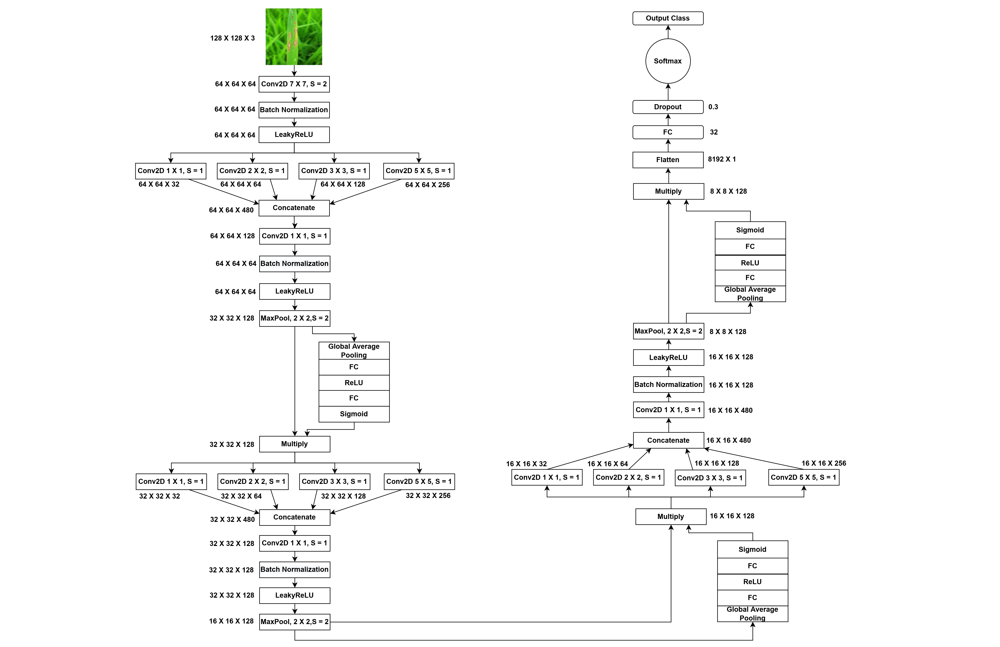
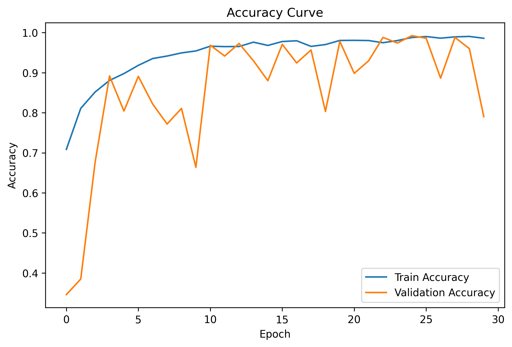
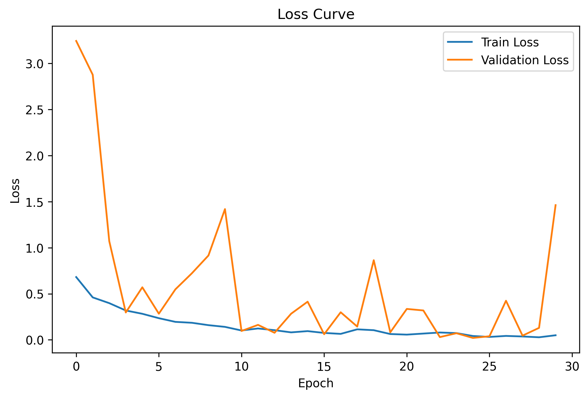
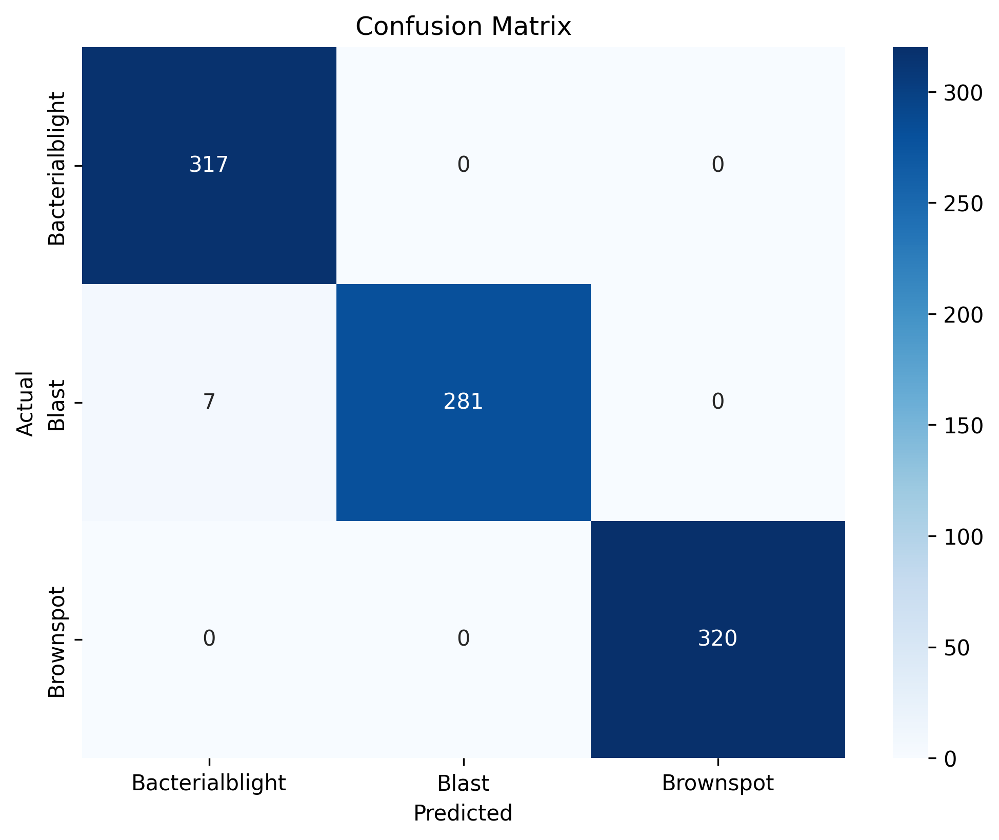

# 🌾 Rice Leaf Disease Classification using SE-SPNet  
### Attention-Enhanced Lightweight Deep Learning Framework for Precision Agriculture

<p align="center">


</p>

---

# 📌 Project Overview

This repository presents **SE-SPNet**, a custom lightweight convolutional neural network architecture designed for automated rice leaf disease classification using deep learning and attention-enhanced feature representation.

The framework is developed for:

- Precision Agriculture
- AI-assisted Crop Monitoring
- Smart Farming Systems
- Early Plant Disease Detection
- Explainable Agricultural AI

Unlike generic transfer learning pipelines, this project introduces a custom research-oriented CNN architecture integrating efficient spatial feature extraction and attention-guided learning.

---

# 🚀 Key Highlights

✅ Custom SE-SPNet Architecture  
✅ Attention-Enhanced Feature Learning  
✅ Lightweight Deep Learning Pipeline  
✅ Research-Oriented CNN Design  
✅ Explainable AI with Grad-CAM  

---

# 🧠 Proposed SE-SPNet Architecture

The proposed SE-SPNet framework combines:

- Convolutional feature extraction
- Attention-guided representation learning
- Lightweight spatial encoding
- Efficient disease discriminative learning
- Robust feature refinement mechanisms

The architecture is specifically optimized for:

- Computational efficiency
- Improved generalization
- Fine-grained disease localization
- Real-world agricultural deployment

---

# 🏗️ Model Architecture

<p align="center">
  
</p>

---

# 📂 Dataset

The dataset contains rice leaf images from multiple disease categories.

## Disease Classes

| Class ID | Disease Name |
|---|---|
| 0 | Bacterial Blight |
| 1 | Blast |
| 2 | Brown Spot |

---

# 🛠️ Technology Stack

| Category | Tools |
|---|---|
| Language | Python |
| Deep Learning | TensorFlow / Keras |
| Computer Vision | OpenCV |
| Data Processing | NumPy / Pandas |
| Visualization | Matplotlib / Seaborn |
| Evaluation | Scikit-learn |
| Environment | Kaggle Notebook |

---

# 📁 Repository Structure

```text
Rice-Leaf-Disease-Classification-SE-SPNet/
│
├── notebooks/
│   └── se_spnet_rice_leaf_classification.ipynb
│
├── src/
│   ├── preprocessing.py
│   ├── dataset.py
│   ├── model.py
│   ├── train.py
│   ├── evaluate.py
│   └── gradcam.py
│
├── results/
│   ├── accuracy_curve.png
│   ├── loss_curve.png
│   ├── confusion_matrix.png
│   ├── gradcam_visualization.png
│   ├── gradcam_overlay.png
│   ├── model_architecture.png
│   └── sample_predictions.png
│
├── models/
│   └── trained_model.h5
│
├── requirements.txt
├── README.md
├── LICENSE
└── .gitignore
```

---

# ⚙️ Installation

## Clone Repository

```bash
git clone https://github.com/your-username/Rice-Leaf-Disease-Classification-SE-SPNet.git
cd Rice-Leaf-Disease-Classification-SE-SPNet
```

---

## Install Dependencies

```bash
pip install -r requirements.txt
```

---

# ▶️ Run Training

```bash
python src/train.py
```

---

# 📊 Model Evaluation

The model is evaluated using:

- Accuracy
- Precision
- Recall
- F1-Score
- Specificity
- Confusion Matrix
- Grad-CAM Visualization

---

# 📈 Experimental Results

| Metric | Score |
|---|---|
| Accuracy | XX.XX% |
| Precision | XX.XX |
| Recall | XX.XX |
| F1-Score | XX.XX |
| Specificity | XX.XX |

> Replace with your final experimental metrics.

---

# 📉 Training Curves

## Accuracy Curve

<p align="center">
  
</p>

---

## Loss Curve

<p align="center">
  
</p>

---

# 🔍 Confusion Matrix

<p align="center">
  
</p>

---

# 🔬 Explainable AI using Grad-CAM

To improve interpretability and model transparency, Grad-CAM visualization is integrated into the pipeline.

The Grad-CAM module highlights disease-relevant spatial regions used by the network during classification.

## Grad-CAM Visualization

<p align="center">
  
</p>

---

# 🌾 Applications

- Smart Agriculture
- Precision Farming
- AI-based Crop Monitoring
- Automated Plant Disease Diagnosis
- Edge-AI Agricultural Systems
- Agricultural Decision Support Systems

---

# 🔬 Research Contributions

### Key Contributions of this Work

- Proposed a custom lightweight CNN architecture (SE-SPNet)
- Integrated attention-enhanced feature learning
- Achieved strong disease classification performance
- Improved explainability using Grad-CAM
- Developed an industry-style reproducible deep learning workflow

---

# 📌 Future Work

Future extensions of this framework include:

- Real-time disease detection
- Mobile deployment
- Transformer-based attention integration
- Multi-crop disease classification
- Edge-device optimization
- Federated agricultural AI systems

---

# 📜 Citation

```bibtex
@article{https://doi.org/10.1111/exsy.13304,
author = {Bhuyan, Parag and Singh, Pranav Kumar and Das, Sujit Kumar and Kalla, Anshuman},
title = {SE\_SPnet: Rice leaf disease prediction using stacked parallel convolutional neural network with squeeze-and-excitation},
journal = {Expert Systems},
volume = {40},
number = {7},
pages = {e13304},
keywords = {CNN, deep learning, leaf disease, smart agriculture, squeeze-and-excitation},
doi = {https://doi.org/10.1111/exsy.13304},
url = {https://onlinelibrary.wiley.com/doi/abs/10.1111/exsy.13304},
eprint = {https://onlinelibrary.wiley.com/doi/pdf/10.1111/exsy.13304},
abstract = {Abstract Rice is one of the significant crops, and the early identification and prevention of its diseases are essential to ensure adequate and healthy availability to the world's growing population. The use of image processing is an encouraging method for automatic rice leaf disease identification and detection. In particular, the recent advancements indicate the effectiveness of convolutional neural network (CNN) based deep learning approaches. In this direction, the present work proposes a novel stacked parallel convolution layers-based network (SPnet) with the squeeze-and-excitation (SE) architecture, named (SE\_SPnet), for classifying diseased rice leaf images. The stacked parallel network block comprises four parallel convolution layers with different kernel sizes for abstractions of the global and local features. The SE block extracts feature information automatically while removing invalid ones. We compare the SE\_SPnet model with state-of-the-art CNN models such as VGG16, DenseNet121, and InceptionV3 based on computational effort, accuracy, sensitivity, specificity, precision, recall, and F1-score. The experimental results show that the SE\_SPnet outperforms standard CNN models for the considered rice leaf disease image datasets. In particular, the SE\_SPnet achieves the highest accuracy (99.2\%), sensitivity (98.2\%), specificity (98.5\%), precision (98.4\%), recall (98.2\%), and F1-score (98.5\%) while using stochastic gradient descent (with momentum) optimizer with a 0.01 learning rate. Furthermore, the SE\_SPnet also exhibits to outperform when compared with some of the most recent and relevant existing works.},
year = {2023}
}
```

---

# 👨‍💻 Author

## Dr. Parag Bhuyan

PhD Researcher — Artificial Intelligence & Computer Vision

### Research Interests

- Computer Vision
- Deep Learning
- Precision Agriculture
- Real Time Object Detection
- Medical & Agricultural Imaging

---

# ⭐ Acknowledgements

- TensorFlow
- Keras
- OpenCV
- Kaggle
- Open-source AI Research Community

---

# 📄 License

This project is licensed under the MIT License.

---

# 💻 Connect With Me

<p align="center">

<a href="https://github.com/parag-cv-ai">
  
</a>

<a href="https://www.linkedin.com/in/dr-parag-bhuyan/">
  
</a>

<a href="https://https://scholar.google.com/citations?user=X5zc0mEAAAAJ&hl=en/">
  
</a>

</p>

---

# 🚀 AI • Computer Vision • Precision Agriculture • Research Engineering

<p align="center">


</p>

---

# 📌 Project Features

<p align="center">


</p>

---

<p align="center">
  ⭐ If you found this project useful, consider giving it a star!
</p>
