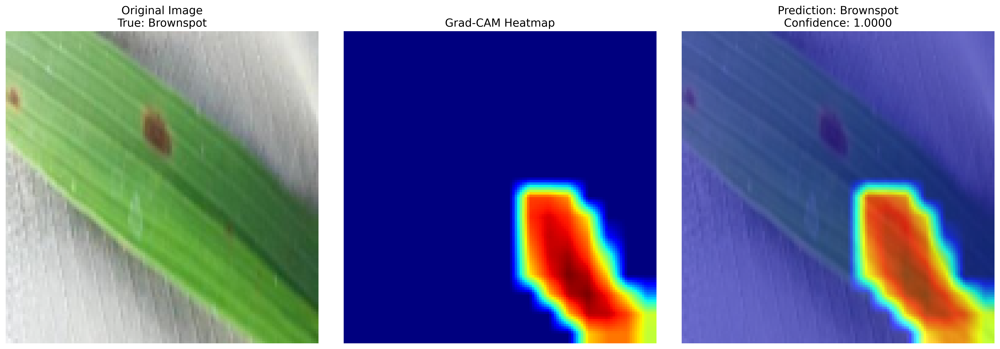

# 🌾 Rice Leaf Disease Classification using SE-SPNet  
### Attention-Enhanced Lightweight Deep Learning Framework for Precision Agriculture

<p align="center">
  
</p>

# 📌 Project Overview

This repository presents **SE-SPNet**, a custom lightweight convolutional neural network architecture designed for automated rice leaf disease classification using deep learning and attention-enhanced feature representation.

The framework is developed for:
- Precision Agriculture
- AI-assisted Crop Monitoring
- Smart Farming Systems
- Early Plant Disease Detection
- Explainable Agricultural AI

Unlike generic transfer learning pipelines, this project introduces a custom research-oriented CNN architecture integrating efficient spatial feature extraction and attention-guided learning.

# 🚀 Key Highlights
✅ Custom SE-SPNet Architecture  
✅ Attention-Enhanced Feature Learning  
✅ Lightweight Deep Learning Pipeline  
✅ Research-Oriented CNN Design  
✅ Grad-CAM Explainability  
✅ Clean Engineering Workflow  
✅ Kaggle + GitHub Reproducibility  

# 🧠 Proposed SE-SPNet Architecture
The proposed SE-SPNet framework combines:
- Convolutional feature extraction
- Attention-guided representation learning
- Lightweight spatial encoding
- Efficient disease discriminative learning
- Robust feature refinement mechanisms

The architecture is specifically optimized for:
- Computational efficiency
- Improved generalization
- Fine-grained disease localization
- Real-world agricultural deployment

# 📂 Dataset

The dataset contains rice leaf images from multiple disease categories.

## Disease Classes

| Class ID | Disease Name |
|---|---|
| 0 | Bacterial Blight |
| 1 | Blast |
| 2 | Brown Spot |

---

# 🛠️ Technology Stack

| Category | Tools |
|---|---|
| Language | Python |
| Deep Learning | TensorFlow / Keras |
| Computer Vision | OpenCV |
| Data Processing | NumPy / Pandas |
| Visualization | Matplotlib / Seaborn |
| Evaluation | Scikit-learn |
| Environment | Kaggle Notebook |

---

# 📁 Repository Structure

```text
Rice-Leaf-Disease-Classification-SE-SPNet/
│
├── notebooks/
│   └── se_spnet_rice_leaf_classification.ipynb
│
├── src/
│   ├── preprocessing.py
│   ├── dataset.py
│   ├── model.py
│   ├── train.py
│   ├── evaluate.py
│   └── gradcam.py
│
├── results/
│   ├── accuracy_curve.png
│   ├── loss_curve.png
│   ├── confusion_matrix.png
│   ├── gradcam_visualization.png
│   ├── model_architecture.png
│   └── sample_predictions.png
│
├── models/
│   └── trained_model.h5
│
├── requirements.txt
├── README.md
├── LICENSE
└── .gitignore

<p align="center">


</p>
